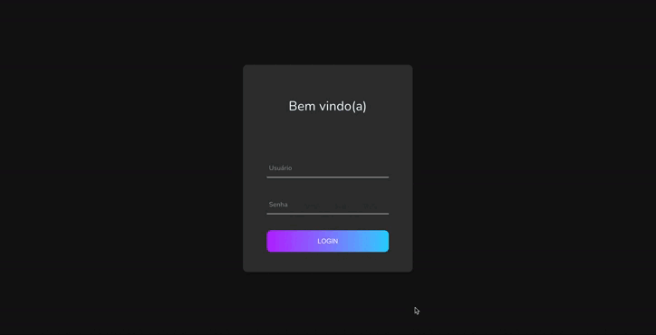

# Projeto React JS - Cadastro de Empresas

Este projeto é o front-end de uma aplicação para gerenciamento de empresas, desenvolvido em React JS. Ele consome uma API desenvolvida em Flask para realizar operações de CRUD (Criar, Ler, Atualizar e Deletar) de empresas.

## Demonstração

<p align="center">
  
</p>

## Consumo da API Flask

O front-end se comunica com uma API desenvolvida em Flask, consumindo os seguintes endpoints:

- GET /empresas: lista todas as empresas.
- POST /empresa: cria uma nova empresa.
- PUT /empresa/<cnpj>: atualiza os dados de uma empresa existente.
- DELETE /empresa/<cnpj>: exclui uma empresa.


## Bibliotecas Utilizadas

- React JS: biblioteca principal para a construção da interface de usuário.
- Axios: para fazer requisições HTTP à API Flask.
- Material-UI (MUI): para estilização e criação de componentes visuais.
- React Input Mask: para facilitar a manipulação de máscaras de input (CNPJ e CNAE).
- React Paginate: para paginação dos dados de empresas.

## Pré-requisitos

- Node.js (versão mínima: 14.x.x)
- NPM (ou Yarn)

## Instruções para executar o projeto localmente

1. Clone o repositório:

```bash
git clone https://github.com/marcoscapiberibe/crud-empresas_ReactJS.git
```

2. Navegue até a pasta do frontend:

```bash
cd frontend
```

3. Instale as dependências necessárias:

```bash
npm install
```

4. Execute o projeto:

```bash
npm start
```

O frontend será aberto no navegador automaticamente em `http://localhost:3000`.

## Usuário de Testes

Para testar a aplicação, utilize as credenciais abaixo:

- **Usuário**: `admin`
- **Senha**: `senha654321`

---
